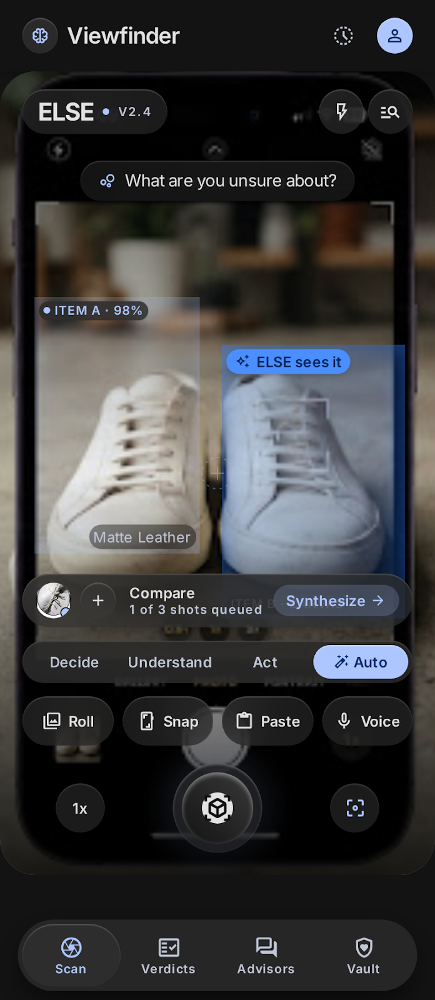
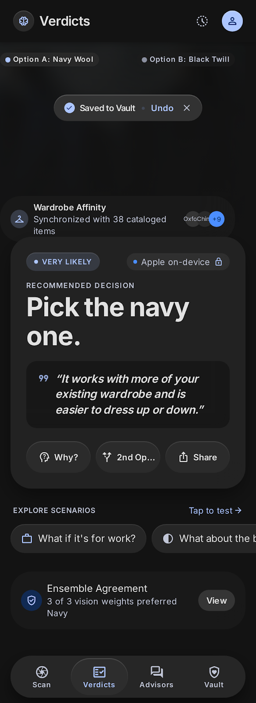
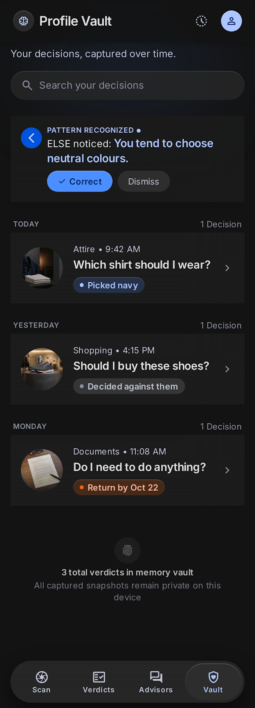
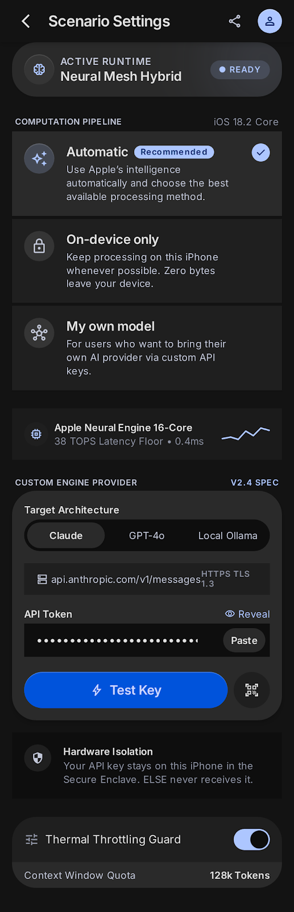

# ELSE

**Your second opinion for real life.**

> See it. Ask it. Know what to do.

ELSE is a free, Siri-first iOS app that turns the camera into a decision copilot — compare items, understand paperwork, and get an honest verdict in a couple of seconds. Default intelligence runs on Apple’s on-device / Private Cloud Compute stack; power users can bring their own model key.

<p align="center">
  
  
  
  
</p>

## Highlights

- **Camera-first** — opens on a live viewfinder, not a home feed
- **Three jobs** — Decide · Understand · Act
- **Engine choice** — Automatic (Apple), On-device only, or My own model (Keychain-stored API key)
- **Personal decision graph** — history stays private on-device / iCloud; models are swappable
- **iOS 27+** — App Intents, Sign in with Apple, liquid-glass UI mirrored from Stitch
- **Always free** — no subscription, no ads, no ELSE usage paywall

## Repository layout

| Path | Description |
| --- | --- |
| [`ios/`](ios/) | SwiftUI app (XcodeGen), deployment target **iOS 27.0** |
| [`backend/`](backend/) | Spring Boot 3.3 API (`com.elseapp`) for optional sync & Sign in with Apple |
| [`designs/`](designs/) | Canonical Stitch export (HTML + `screen.png`) — UI source of truth |
| [`docs/`](docs/) | Product draft, design notes, README screenshots |

## Design fidelity

UI is implemented against the Stitch pack in `designs/`. Tokens come from:

- `designs/liquid_glass_native_interface/DESIGN.md`
- `designs/liquid_indigo_glass/DESIGN.md`

Screens use a flexible layout system (`ElseCanvas` / `ElseFlexibleColumn`) so chrome stays pixel-faithful on the design width (~430pt max) and scales cleanly on larger iPhones (Pro / Pro Max) via:

- centered `max-w-md` columns
- equal-width (`flex-1`) bottom tabs
- type & shutter sizing relative to screen width
- safe-area aware stacks (no fixed 390×844 frame)

Open **Engine Settings → Stitch Screen Gallery** in the app to walk every mirrored screen.

| Stitch folder | SwiftUI |
| --- | --- |
| `first_launch_onboarding` | `OnboardingView` |
| `sign_in_with_apple_else` | `SignInWithAppleView` |
| `capture_primary_home` | `CaptureHomeView` |
| `verdict_decide_clothes` | `VerdictDecideView` |
| `verdict_act_document` | `VerdictActView` |
| `second_opinion_comparison` | `SecondOpinionView` |
| `your_else_history` | `HistoryView` |
| `empty_history_else` | `EmptyHistoryView` |
| `history_detail_shoes_decision` | `HistoryDetailView` |
| `engine_settings_providers` | `EngineSettingsView` |
| `my_own_model_else` | `MyOwnModelView` |
| `privacy_memory_else` | `PrivacyMemoryView` |
| `shareable_verdict_card_else` | `ShareVerdictView` |
| `blurry_photo_error_else` | `BlurryPhotoErrorView` |
| `low_confidence_else` | `LowConfidenceView` |
| `offline_else` | `OfflineView` |
| `else_refined_optical_aperture_logo` | `LogoMarkView` |

## Requirements

- **Xcode 27+** / iOS 27 SDK
- **Java 21** + Maven 3.9+ (backend)
- [XcodeGen](https://github.com/yonaskolb/XcodeGen) (`brew install xcodegen`)

## iOS

```bash
cd ios
xcodegen generate
open ELSE.xcodeproj
```

Select an iOS 27 simulator or device, then Run.

Bundle ID defaults to `com.aeswibon.else`. Update `DEVELOPMENT_TEAM` in `ios/project.yml` if needed.

## Backend

```bash
cd backend
mvn spring-boot:run
```

| Method | Path | Purpose |
| --- | --- | --- |
| `GET` | `/api/v1/health` | Liveness |
| `POST` | `/api/v1/auth/apple` | Sign in with Apple (subject → user) |
| `POST` | `/api/v1/decisions` | Persist a Context Object / verdict |
| `GET` | `/api/v1/decisions?userId=` | List history |
| `GET` | `/api/v1/decisions/{id}` | Fetch one |
| `DELETE` | `/api/v1/decisions/{id}` | Soft-delete |

Local profile uses H2 (`./.data/else`). For Postgres, run with `--spring.profiles.active=prod` and set `ELSE_DB_URL`, `ELSE_DB_USER`, `ELSE_DB_PASSWORD`.

```bash
mvn test
```

## Product

See [`docs/PRODUCT.md`](docs/PRODUCT.md) for positioning, moat, V1 scope, and success metrics.

**Tagline:** See it. Ask it. Know what to do.

## License

All rights reserved for now — opening the source for collaboration. If you need a specific license (MIT/Apache-2.0), open an issue.

## Acknowledgments

UI artboards generated with [Google Stitch](https://stitch.withgoogle.com/). Visual system inspired by Apple’s liquid glass materials.
